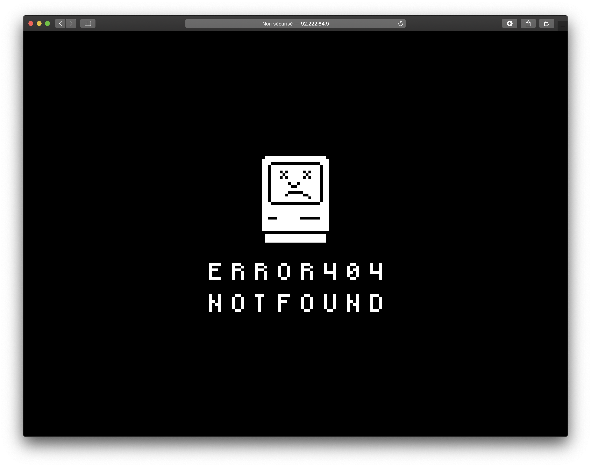

# Ready Server Docker Container

## Install

### Requirements

- Docker
- docker-compose (>= 3.5)

### Up server

To up basic server with **Nginx** reverse proxy and  [Portainer](https://www.portainer.io) (to manage your container), dowload this repository on your server.

On the repository root, run `docker-compose up -d --build`.

This command will mount a **Nginx** reverse proxy server container (expose to your 80 port) and **Portainer** (expose to your 9000 port).

Once process finish, you can check your server by going to his IP address on your browser and you should see a basic 404 web page like this :

